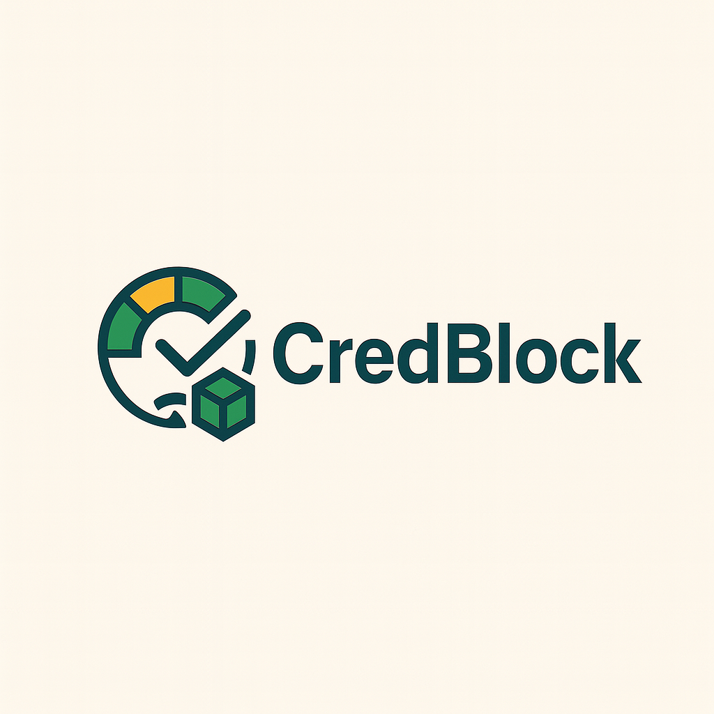

# CredBlock - DeFi Credit Tracker

<div align="center">
  
  
  **Decentralized Credit Scoring for Web3**
  
  [](https://opensource.org/licenses/MIT)
  [](https://www.python.org/downloads/)
  [](https://reactjs.org/)
  [](https://fastapi.tiangolo.com/)
</div>

## 🚀 Overview

CredBlock is a revolutionary decentralized credit scoring platform that brings transparency, accessibility, and fairness to Web3 financial ecosystems. Instead of relying on opaque, centralized credit bureaus, CredBlock leverages on-chain activity, multi-chain wallet analytics, and machine learning models to generate dynamic creditworthiness profiles.

### 🎯 Key Features

- **🔗 Multi-Chain Support**: SEI, Ethereum, and Solana integration
- **🤖 AI-Powered Scoring**: ML models for accurate credit assessment
- **📊 Real-Time Analytics**: Live blockchain data analysis
- **⚡ Fast API**: Sub-second response times with Redis caching
- **🛡️ Privacy-First**: No personal data collection, only public blockchain data
- **🎨 Modern UI**: Beautiful, responsive interface with CredBlock branding

## 🏗️ Architecture

```
┌─────────────────┐    ┌─────────────────┐    ┌─────────────────┐
│   Frontend      │    │   Backend API   │    │   Blockchain    │
│   (React/Vite)  │◄──►│   (FastAPI)     │◄──►│   Networks      │
│                 │    │                 │    │   (SEI/ETH/SOL) │
└─────────────────┘    └─────────────────┘    └─────────────────┘
         │                       │                       │
         │                       ▼                       │
         │              ┌─────────────────┐              │
         │              │   Redis Cache   │              │
         │              │   PostgreSQL    │              │
         │              └─────────────────┘              │
         │                                               │
         ▼                                               ▼
┌─────────────────┐                            ┌─────────────────┐
│   ML Models     │                            │   External APIs │
│   (AWS S3)      │                            │   (Etherscan,   │
│                 │                            │   Solana RPC)   │
└─────────────────┘                            └─────────────────┘
```

## 🛠️ Tech Stack

### Backend
- **Framework**: FastAPI (Python 3.11+)
- **Database**: PostgreSQL + Redis
- **Blockchain**: Web3.py, Solana SDK
- **ML**: scikit-learn, joblib
- **Infrastructure**: Docker, AWS S3

### Frontend
- **Framework**: React 18 + TypeScript
- **Build Tool**: Vite
- **Styling**: Tailwind CSS + shadcn/ui
- **State**: TanStack Query
- **Routing**: React Router

### Blockchain Integrations
- **SEI**: Native precompiles for staking & governance
- **Ethereum**: Web3.py + Etherscan API
- **Solana**: Solana SDK + RPC endpoints

## 🚀 Quick Start

### Prerequisites
- Python 3.11+
- Node.js 16+
- Docker Desktop (running)

### 1. Clone the Repository
```bash
git clone https://github.com/eshaanmathakari/credBlock.git
cd credblock
```

### 2. Start the Application
```bash
# Start everything (recommended)
./start-local.sh
```

This will:
- Start Redis and PostgreSQL containers
- Set up Python virtual environment
- Install dependencies
- Start backend on port 8001
- Start frontend on port 8080

### 3. Access the Application
- **Frontend**: http://localhost:8080
- **Backend API**: http://localhost:8001
- **API Documentation**: http://localhost:8001/docs

## 📖 Usage

### Web Interface
1. Open http://localhost:8080
2. Enter a wallet address (SEI, Ethereum, or Solana)
3. Select the blockchain network
4. Click "Get Credit Score"
5. View detailed score breakdown and factors


### Example Response
```json
{
  "wallet": "walletaddresshere",
  "chain": "sei",
  "score": 750,
  "risk": "Low Risk",
  "confidence": 0.85,
  "factors": {
    "Account Age": 25,
    "Tx Activity": 30,
    "Balances": 20,
    "DeFi Extras": 15,
    "Staking": 10,
    "Governance": 5
  },
  "latency_ms": 120,
  "model_version": "v1.0.0"
}
```

## 🔧 Development

### Alternative Startup Methods

**Backend only:**
```bash
./start-backend.sh
```

**Frontend only:**
```bash
./start-frontend.sh
```

**Docker Compose:**
```bash
./start-docker.sh
```

### Environment Configuration
```bash
# Copy environment template
cp env.template .env

# Edit configuration
nano .env
```

Key environment variables:
- `VITE_API_BASE_URL`: Frontend API endpoint
- `REDIS_URL`: Redis connection string
- `SEI_RPC_URL`: SEI network RPC endpoint
- `ETHEREUM_RPC`: Ethereum RPC endpoint
- `SOLANA_RPC_URL`: Solana RPC endpoint

### Project Structure
```
credblock/
├── backend/                 # FastAPI backend
│   ├── services/           # Blockchain services
│   ├── chains/            # Chain-specific implementations
│   ├── ml/                # Machine learning models
│   └── abis/              # Smart contract ABIs
├── frontend/              # React frontend
│   ├── src/
│   │   ├── components/    # React components
│   │   ├── pages/         # Page components
│   │   └── hooks/         # Custom hooks
│   └── public/            # Static assets
├── images/                # Project assets
├── chrome-extension/      # Browser extension
└── scripts/               # Utility scripts
```

## 🧪 Testing

### Backend Health Check
```bash
curl http://localhost:8001/health
```

### Test Credit Score API
```bash
# SEI test wallet
curl "http://localhost:8001/v1/score/"

# Ethereum test wallet
curl "http://localhost:8001/v1/score/"
```

### Frontend Testing
```bash
cd frontend
npm test
```

## 🚀 Deployment

### Docker Deployment
```bash
# Build and start all services
docker-compose up --build

# Production deployment
docker-compose -f docker-compose.ec2.yml up -d
```

### AWS Deployment
```bash
# Deploy to AWS EC2
./deploy-aws.sh
```
## 📊 Credit Scoring Algorithm

CredBlock uses a sophisticated multi-factor scoring system:

### Scoring Factors
1. **Account Age** (0-25 points): Wallet creation date and activity duration
2. **Transaction Activity** (0-30 points): Transaction frequency and patterns
3. **Balance Management** (0-20 points): Token holdings and portfolio diversity
4. **DeFi Interactions** (0-15 points): Protocol usage and liquidity provision
5. **Staking Activity** (0-10 points): Network participation and staking history
6. **Governance Participation** (0-5 points): Voting and proposal participation

### Score Ranges
- **850-1000**: Excellent (A+)
- **700-849**: Good (A)
- **500-699**: Fair (B)
- **300-499**: Poor (C)
- **0-299**: Very Poor (D)

### Risk Assessment
- **Low Risk**: Score 700+
- **Medium Risk**: Score 500-699
- **High Risk**: Score <500

## 🔒 Security & Privacy

- **No Personal Data**: Only analyzes public blockchain data
- **No Wallet Connection**: Uses public addresses only
- **Encrypted Storage**: All cached data is encrypted
- **Rate Limiting**: API rate limits prevent abuse
- **CORS Protection**: Configured for secure cross-origin requests

## 🤝 Contributing

We welcome contributions! Please see our [Contributing Guidelines](CONTRIBUTING.md) for details.

### Development Setup
1. Fork the repository
2. Create a feature branch
3. Make your changes
4. Add tests
5. Submit a pull request

## 📄 License

This project is licensed under the MIT License - see the [LICENSE](LICENSE) file for details.

## 🙏 Acknowledgments

- **SEI Foundation** for hosting the hackathon that inspired this project
- **SEI Network** for providing excellent developer tools and documentation
- **Open Source Community** for the amazing tools and libraries we use

## 📞 Support
- **Issues**: [GitHub Issues](https://github.com/eshaanmathakari/credBlock/issues)
- **Discussions**: [GitHub Discussions](https://github.com/eshaanmathakari/credBlock/discussions)

## 🌟 Features Roadmap

- [ ] **Chrome Extension**: React Native Chrome extension for everyone to use
- [ ] **Advanced Analytics**: Historical trend analysis across 20+ Blockchains
- [ ] **Institutional Grade API Tools**: Enterprise-grade API Features for meeting every need 

---

<div align="center">
  <p>Built with ❤️ for the Web3 community</p>
  <p>
    <a href="https://github.com/eshaanmathakari/credBlock">GitHub</a> •
    <a href="https://credblock.sol">Website</a> •
    <a href="https://x.com/DevSeekers">Twitter</a>
  </p>
</div>
